#NSCTFAPRW4
##Marvel Vs. DC

<h1></h1>
<h2>Challenge 1 : Marvel</h2>
**Description:** You have to find robots.txt but that file was blank. If you open that robots.txt file with specific user-agent you will get the flag.

**Steps to solve:**

1. Open the provided link in challenge.

    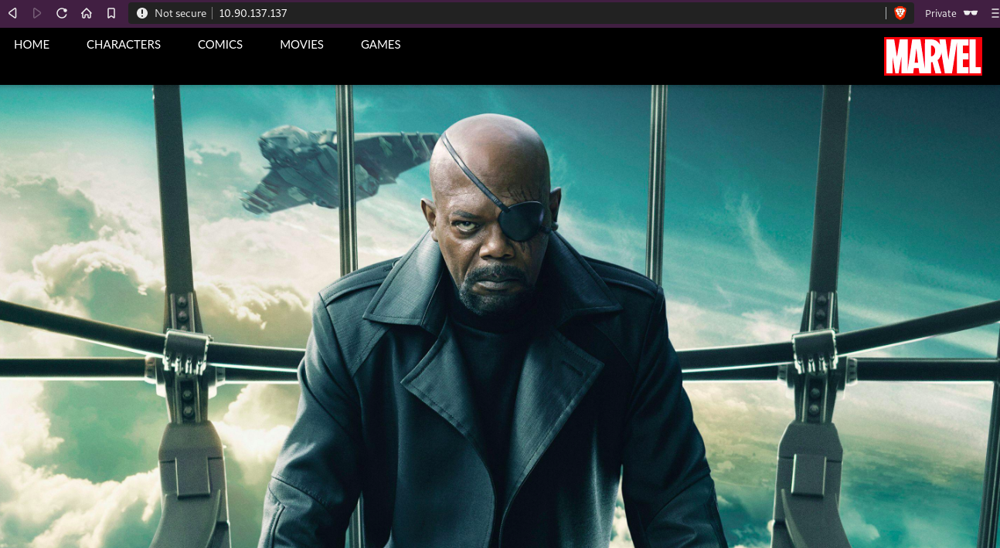
2. View page source of the page and observe that threre are two encoded strings in comments.

    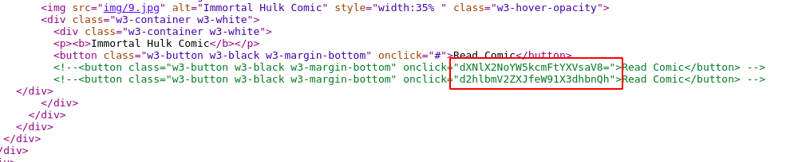
3. Decode those string and get the text.

    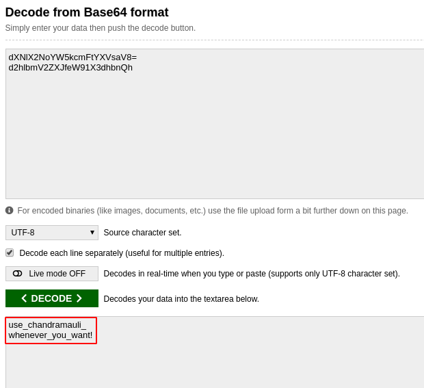
4. Open robots.txt file and observe that robots.txt file is empty.

    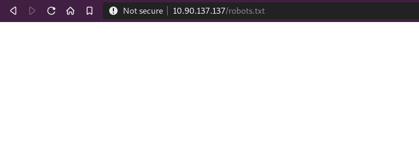
5. To change the user-agent, add any user-agent switcher extension and change the user agent to "chandramauli". Try to open robots.txt file and observe the response.

    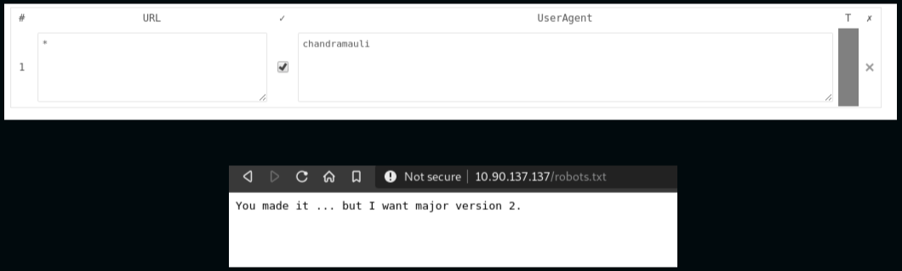
6. Observe the server response and change user-agent accordingly to response. At last, you will be able to open robots.txt file when you will change user-agent as "chandramauli/2.3.22". At the end of robots.txt file you will find the flag.
    
    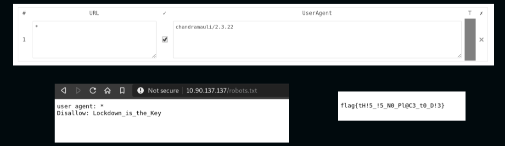

**Flag:**  nsctf{tH!5\_!5\_N0\_Pl@C3\_t0\_D!3}

<h1></h1>
<h2>Challenge 2 : Recover the flags</h2>

**Description:** In this challenge, you have to find the flag from configuration file of running services.

**Steps to solve:**

1. Try to access the directory(Lockdown_is_the_Key) which you found in first challenge and observe the source code of that page. You will find two links. Click on any of the link and observe that there is one parameter(lang) in the URL.

    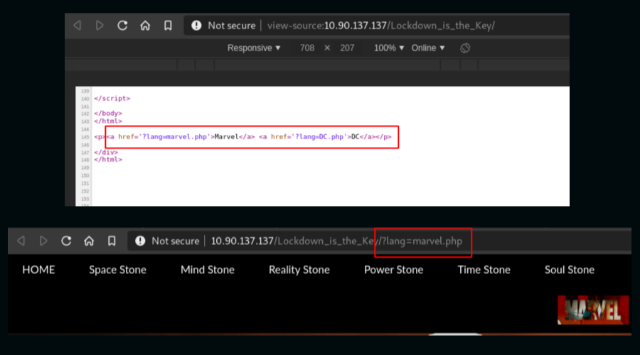
2. Check for "File retrieval" on the "lang" parameter.

    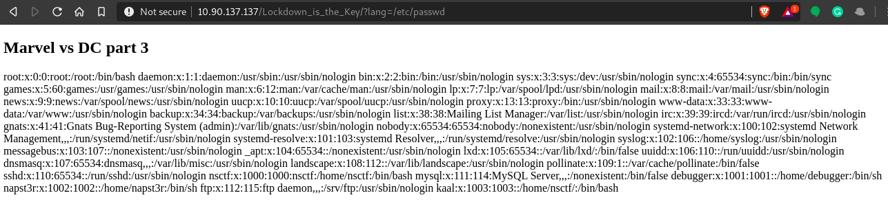 
3. Now you need to check which services are running on the server.
    
    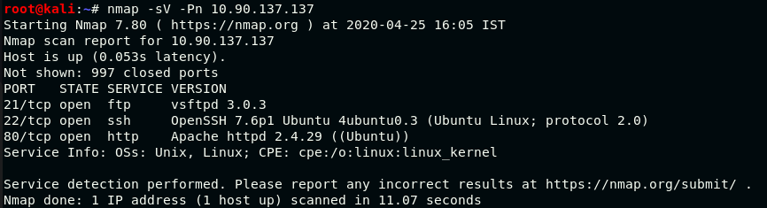
4. Try to retrieve the configuration file(/etc/vsftpd.conf) of running services and observe the flag.

    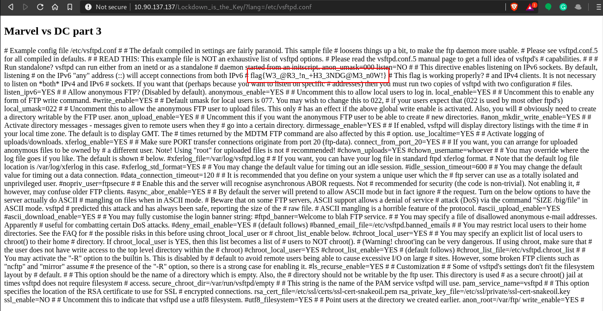

**Flag:**  nsctf{W3\_@R3\_!n\_+H3\_3NDG@M3\_n0W!}

<h1></h1>
<h2>Challenge 3 : Findout the vulnerability</h2>

**Description:** Try to upload a file in server and you can use that file to gain more information about the server.

**Steps to solve:**

1. Observe the vsftpd.conf file which says that anonymous user has access to write in /var/ftp directory.

    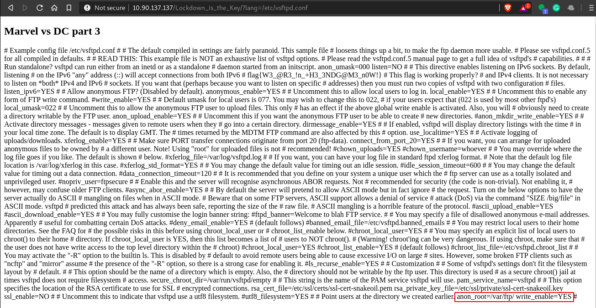
2. Try to login using "anonymous" user and observe that anonymous login allowed. Now  try to upload the backdoor file which you have created.

    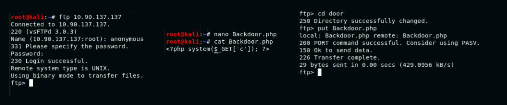
3. Access the backdoor file and try "ls" command to list down the files. Observe those file which discloses the username and password. You can use username and password for ssh connection.

    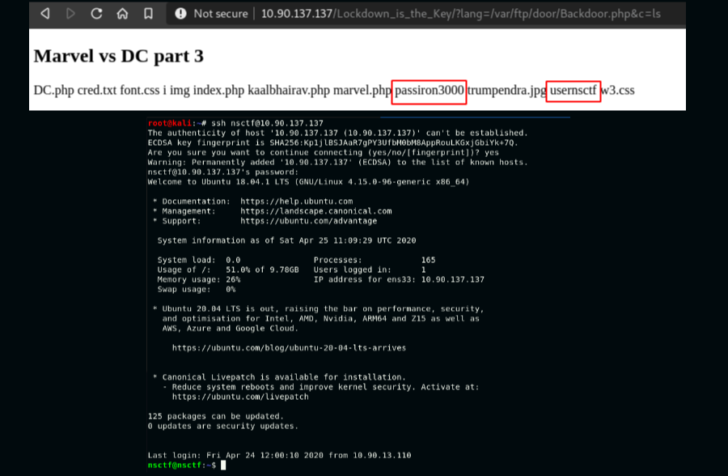
4. Enumerate the directories and you will find the "flag.c" file which has flag.
    
    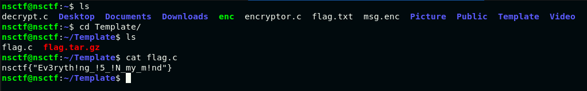

**Flag:**  nsctf{"Ev3ryth!ng\_!5\_!N\_my\_m!nd"}

<h1></h1>
<h2>Challenge 4</h2>

**Description:** You got "flag.tar.gz" file which contains encrypted message mad the encryption logic. You have to decrypt the message to get the flag.

**Steps to solve:**

1. Copy the file "flag.tar.gz" and extract the file. Observe that there are two files. One is encrypted message & other file contains encryption logic.

    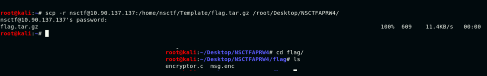
2. You have to modify the "encryptor.c" file to get the flag from "msg.enc" file. You have to use the hint from first challenge and replace the "chandramauli" in key value. Replace "+" instead of "-" in X-OR logic and save the file.
    
    
3. Compile the "encryptor.c" file again and decrypt the encrypted message.

    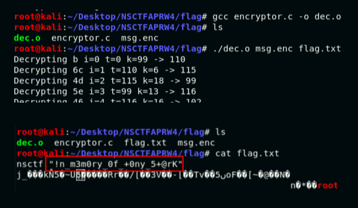

**Flag:**  nsctf{"!n\_m3m0ry\_0f\_+0ny\_5+@rK"}
